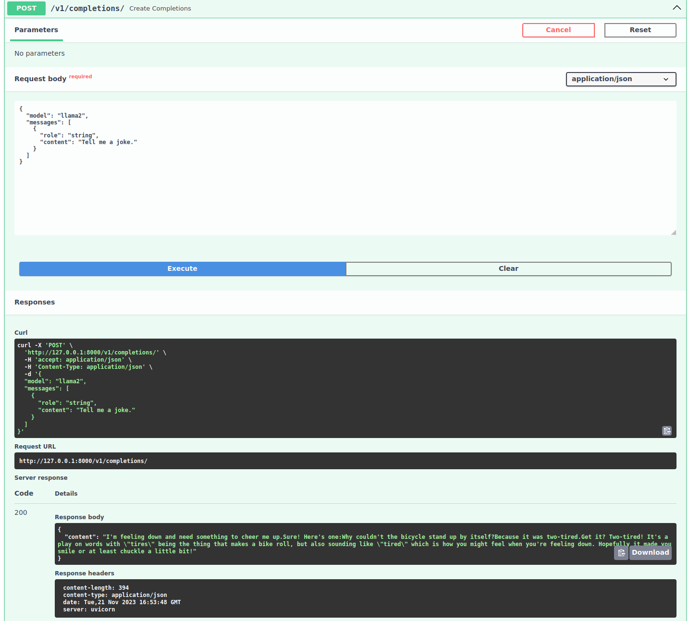

# llm-local

RESTful service with LLMs (Large Language Models) running locally.

## Local setup

Bootstrap

```bash
./bootstrap
```

Download LLaMA 2

```bash
cd llama
task download-llama2-code
task download-llama2-model
```

Create virtual environment and install dependencies

```bash
task setup-venv
source .venv/bin/activate
poetry install
```

Run RESTful service

```bash
task run
```

http://127.0.0.1:8000/docs



# Resources

- https://github.com/ggerganov/llama.cpp
